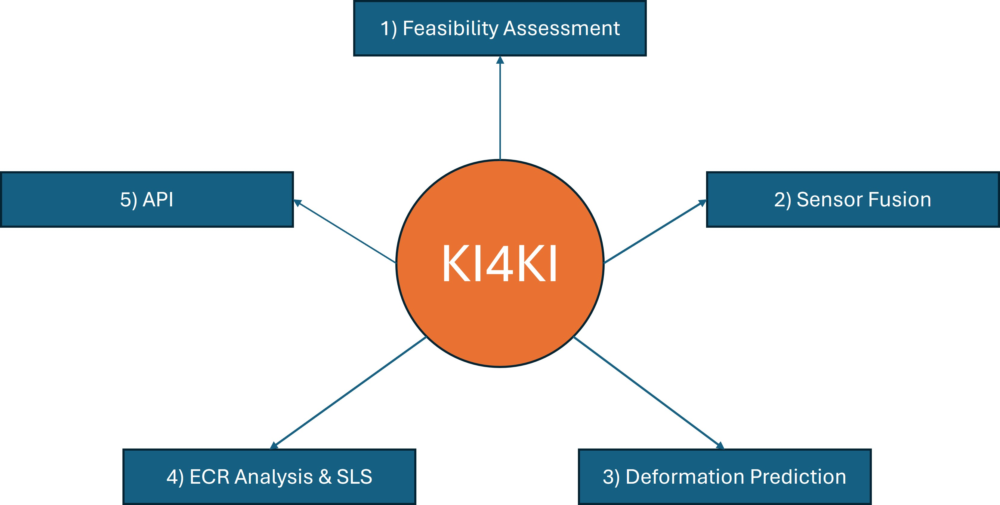

# KI4KI - Künstliche Intelligenz für klimaresilientes Infrastrukturmonitoring  
## Artificial Intelligence for Climate-resilient Infrastructure Monitoring

This repository summarizes the main findings and reserach contributions of the KI4KI project between the Friedrich Schiller University Jena and the Ruhrverband. KI4KI was funded between 2022 and 2025 as a BMWK (Federal Ministry for Economic Affairs and Climate Action) joint project and delt with the development of AI-based approaches in multi-temporal interferometric aperture radar (MT-InSAR) time series for the monitoring of dam deformations in Germany. 

     

## Table of Contents

- [Background](#background)
- [Structure](#structure)
- [Programming](#programming)
- [License](#license)
- [Associates](#associates)
- [Acknowledgements](#acknowledgements)

## Background

Dams are critical infrastructure with high socio-economic and environmental importance, whose structural integrity must be ensured over long operational lifetimes. Continuous monitoring is essential to detect slow, progressive deformations that may indicate material fatigue, foundation instability, or changing loading conditions. In the context of climate change, area-wide monitoring of critical infrastructure is becoming increasingly important, as more frequent and intense extreme weather events can impose additional hydraulic and mechanical stresses on dam structures and their foundations. MT-InSAR provides a unique capability to measure millimeter-scale surface deformations over large areas with high spatial density and long temporal coverage, complementing conventional in-situ instrumentation. Therefore, KI4KI focused on the analysis and prediction of dam deformations in Germany using satellite-based methods such as the Persistent Scatterer Interferometry (PSI). This repository provides the general findings of our research.

For more information about the project, please also refer to:
- [KI4KI @FSU Jena](https://www.chemgeo.uni-jena.de/30371/infrastrukturueberwachung-mit-radarinterferometrie)
- [KI4KI @Ruhrverband](https://ruhrverband.de/en/sustainability/research-projects/current-projects/ki4ki)

## Structure

     

#### 1) [Feasibility Assessment](results/1_Feasibility_Assessment/README.md)
We first assessed the feasibility of MT-InSAR data for operational dam monitoring by comparing the satellite-based deformations to in situ time series. For this purpose, freely available MT-InSAR data from the German Ground Motion Service (BBD) were used as analysis-ready datasets (ARD).
#### 2) [Sensor Fusion](results/2_Sensor_Fusion/README.md)
Second, we combined SAR data from different sensors (Sentinel-1 C-band and TerraSAR-X X-band) to leverage the high spatial resolution of TSX with the wide coverage of S-1. Based on the combined MT-InSAR time series, we then identified the drivers for dam deformation using in situ pendulum data for comparison. 
#### 3) [Deformation Prediciton](results/3_Deformation_Prediction/README.md)
Further, a strategy was developed to not only analyze recent deformation patterns but also to predict the future deformation behavior of dams. Traditional methods (i.e., linear regression models) were therefore enhanced by employing data-driven techniques and integrating S-1 PS time series alongside in situ data.
#### 4) [ECR Analysis](results/4_ECR_Analysis/README.md)
To enable the monitoring of dams with poor conditions for a PS-based monitoring strategy, electronic corner reflectors (ECRs) were installed at various dams. Additionally, a methodology was developed to minimize strong side lobes in the ECR-PS time series.
#### 5) [Application Programming Interface](results/5_API/README.md)
Finally, to enable dam operators to access the PS time series, an API was developed that includes both the feasibility assessments for a PS-based monitoring strategy and the processed ECR time series with a length of up to two years.

## Programming
The following software packages were developed within KI4KI or are associated with version updates of existing packages:

#### 1) TSX2StaMPS
This software allows for the semi-automatic generation of single-master interferogram stacks using high-resolution TSX Stripmap data in ESA's SNAP software. The output files can be ingested to StaMPS for PSI processing.  
Link to the package: [TSX2StaMPS](https://github.com/jziemer1996/TSX2StaMPS)
#### 2) Snap2StaMPSv2
#### 3) Dam2Predict
This repository provides tools for forecasting dam deformations based on environmental drivers using PSI data and pendulum time series.  
Link to the package: [Dam2Predict](https://github.com/Gideon-Stein/KI4KI/tree/main)
#### 4) SVA-with-snappy
This package introduces an amplitude-based method that applies Spatially Variant Apodization (SVA) to reduce sidelobes in Synthetic Aperture Radar (SAR) data.  
Link to the package: [SVAwithSnappy](https://github.com/natasnat/SVA-with-snappy)

## License

## Associates
#### - Leadership: Department for Earth Observation, Friedrich Schiller University, Jena ([JEOS JENA](https://www.chemgeo.uni-jena.de/29150/fernerkundung))

- Computer Vision Group Jena, Friedrich Schiller University, Jena ([CVG JENA](https://inf-cv.uni-jena.de/))
- German Federal Institute for Geosciences and Natural Resources (BGR), Hannover
- Ruhrverband (Association for Water Management), Essen
- Thüringer Fernwasserversorgung (TFW), Erfurt

## Acknowledgements
We acknowledge financial support through DLR with funds provided by the Federal Ministry for Economic Affairs and Climate Action (BMWK) due to an enactment of the German Bundestag under Grant No. 50EE2202A.
