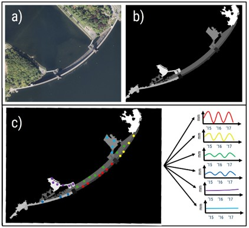

# KI4KI
## Artificial Intelligence for Climate-resilient Infrastructure Monitoring

This repository summarizes the main findings and reserach contributions of the KI4KI project between the Friedrich Schiller University Jena and the Ruhrverband. KI4KI was funded between 2022 and 2025 as a BMWK (Federal Ministry for Economic Affairs and Climate Action) joint project and delt with the development of AI-based approaches in multi-temporal interferometric aperture radar (MT-InSAR) time series for the monitoring of dam deformations in Germany. 

 

### Table of Contents

- [Background](#background)
- [Results](#results)
- [Programming](#programming)
- [License](#license)
- [Associates](#associates)
- [Acknowledgements](#acknowledgements)

### Background

Dams are critical infrastructure with high socio-economic and environmental importance, whose structural integrity must be ensured over long operational lifetimes. Continuous monitoring is essential to detect slow, progressive deformations that may indicate material fatigue, foundation instability, or changing loading conditions. In the context of climate change, area-wide monitoring of critical infrastructure is becoming increasingly important, as more frequent and intense extreme weather events can impose additional hydraulic and mechanical stresses on dam structures and their foundations. MT-InSAR provides a unique capability to measure millimeter-scale surface deformations over large areas with high spatial density and long temporal coverage, complementing conventional in-situ instrumentation. Therefore, KI4KI focused on the analysis and prediction of dam deformations in Germany using satellite-based methods such as the Persistent Scatterer Interferometry (PSI). This repository provides the general findings of our research.

For more information about the project, please also refer to:
- [KI4KI @FSU Jena](https://www.chemgeo.uni-jena.de/30371/infrastrukturueberwachung-mit-radarinterferometrie)
- [KI4KI @Ruhrverband](https://ruhrverband.de/en/sustainability/research-projects/current-projects/ki4ki)

### Results

 

#### 1) Feasibility Assessment of MT-InSAR and GMS for Dam Monitoring
Unterschiedliche Talsperren, CR-Index, mein Paper + Janniks GMS Evaluation
#### 2) Sensor Fusion of Different SAR Data and Identification of Deformation Drivers
#### 3) Prediction of Dam Deformations using Advanced Feature Engineering
#### 4) Using Electronic Corner Reflectors (ECR) for Dam Monitoring
#### 5) Application Programming Interface

### Programming

TSX2StaMPS/snap2stamps
Gideons prediction tool
Nataschas Package

### License

### Associates
- Leadership: Department of Earth Observation, Friedrich Schiller University, Jena ([JEOS JENA](https://www.chemgeo.uni-jena.de/29150/fernerkundung))

- Computer Vision Group Jena, Friedrich Schiller University, Jena ([CVG JENA](https://inf-cv.uni-jena.de/))
- German Federal Institute for Geosciences and Natural Resources (BGR), Hannover
- Ruhrverband (Association for Water Management), Essen
- Thüringer Fernwasserversorgung (TFW), Erfurt

## Acknowledgements
We acknowledge financial support through DLR with funds provided by the Federal Ministry for Economic Affairs and Climate Action (BMWK) due to an enactment of the German Bundestag under Grant No. 50EE2202A.
