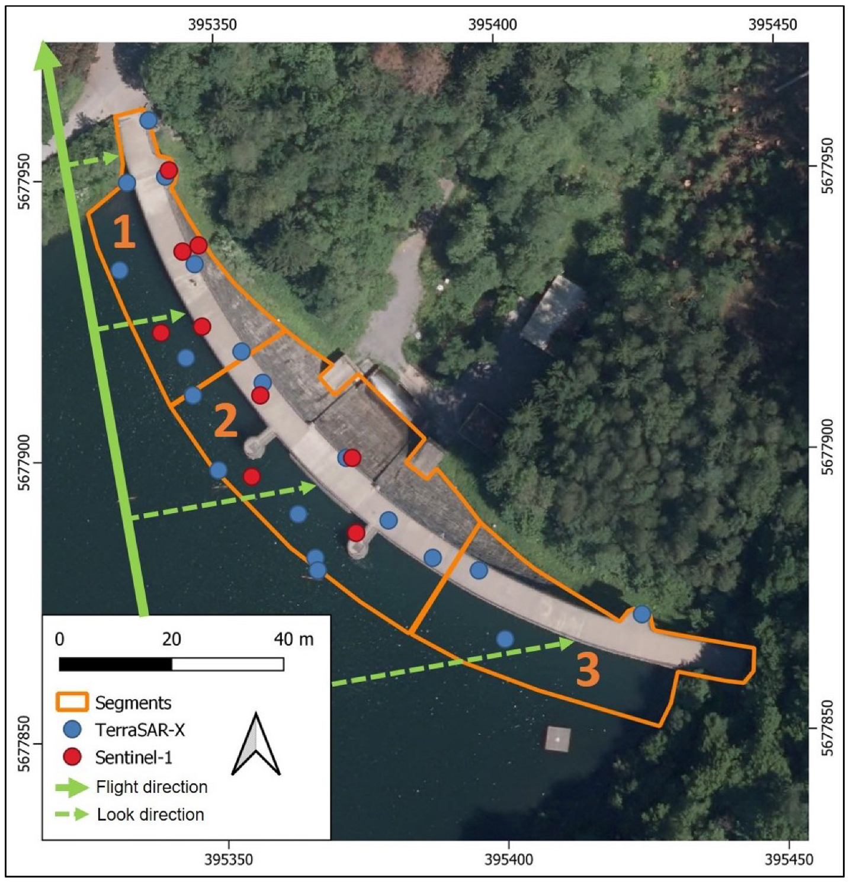

#### Sensor Fusion of Different SAR Data and Identification of Deformation Drivers

This part of our work introduced a spaceborne multi-sensor approach for monitoring a gravity dam in Germany using PS datasets from different wavelengths. Applying [TSX2StaMPS](https://github.com/jziemer1996/TSX2StaMPS) as part of the updated [Snap2StaMPSv2](https://github.com/mdelgadoblasco/snap2stamps/tree/v2.0.1) package, the S-1 data were integrated with high-resolution TSX data to enhance the spatial and temporal resolution of the time series. Our analyses demonstrated that **combining TerraSAR-X and Sentinel-1 PS time series substantially improves the spatial and temporal characterization of dam deformations**. Sensor fusion **increased PS point density, reduced effective revisit times, and enabled a more robust analysis of segment-wise radial deformations**, yielding a fair agreement with in situ pendulum measurements (**R² = 0.5**, **MAE = 2.3 mm**). The integrated time series facilitated the identification of **temperature as the dominant long-term driver of periodic deformations**, while **water level variations were found to primarily influence short-term deformation behavior**, particularly after reservoir impoundment. Overall, the results confirm that multi-sensor MT-InSAR data fusion enhances deformation monitoring and supports the reliable attribution of observed deformation patterns to environmental forcing mechanisms, especially in cases where conventional in situ instrumentation is sparse or absent.

     

© Ziemer, J., Jänichen, J., Stein, G., Liedel, N., Wicker, C., Last, K., ... & Dubois, C. (2025). Identifying deformation drivers in dam segments using combined X-and C-band PS time series. Remote Sensing, 17(15), 2629.
