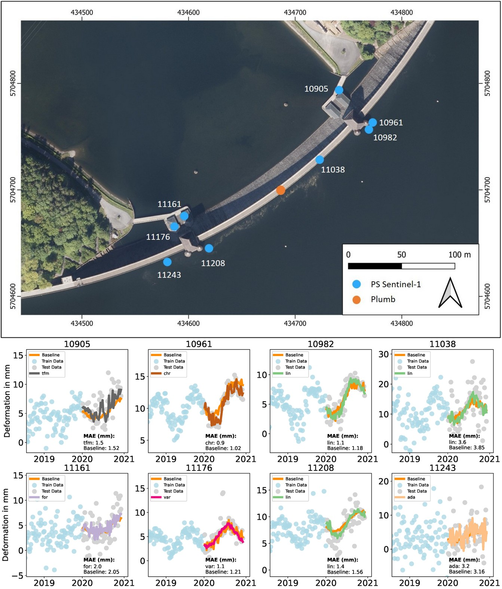

#### Prediction of Dam Deformations using Advanced Feature Engineering

Our analyses demonstrate that integrating Persistent Scatterer Interferometry (PSI) with in situ data provides a robust and accurate framework for predicting expected deformations of gravity dams, particularly under increasing stress from climate-driven extreme weather events. By combining PSI time series with environmental variables such as water level and temperature, the proposed approaches enable deformation monitoring even for dams with sparse or infrequent in situ measurements. We advanced deformation prediction by applying data-driven feature engineering and model selection to both in situ and PSI datasets. For pendulum measurements, prediction accuracy improved substantially, reducing the **MAE from 0.51 mm (R² = 0.92) in the baseline model to 0.05 mm (R² = 0.99) using an expanded model search space**. Although predictions based on PS time series were inherently less precise than pendulum data, the models still achieved **MAE values of up to 0.81 mm**, with **error reductions of up to 0.25 mm** through advanced modeling and filtering of noisy PS points. Overall, the studies show that PSI significantly enhances the spatial resolution of deformation monitoring and, when combined with data-driven modeling and extended representations of water level–temperature interactions, provides a valuable and scalable complement to traditional dam monitoring systems.

     

© [Enhancing the Prediction of Dam Deformations: A Novel Data-Driven Approach](https://www.mdpi.com/2072-4292/17/6/1026)
