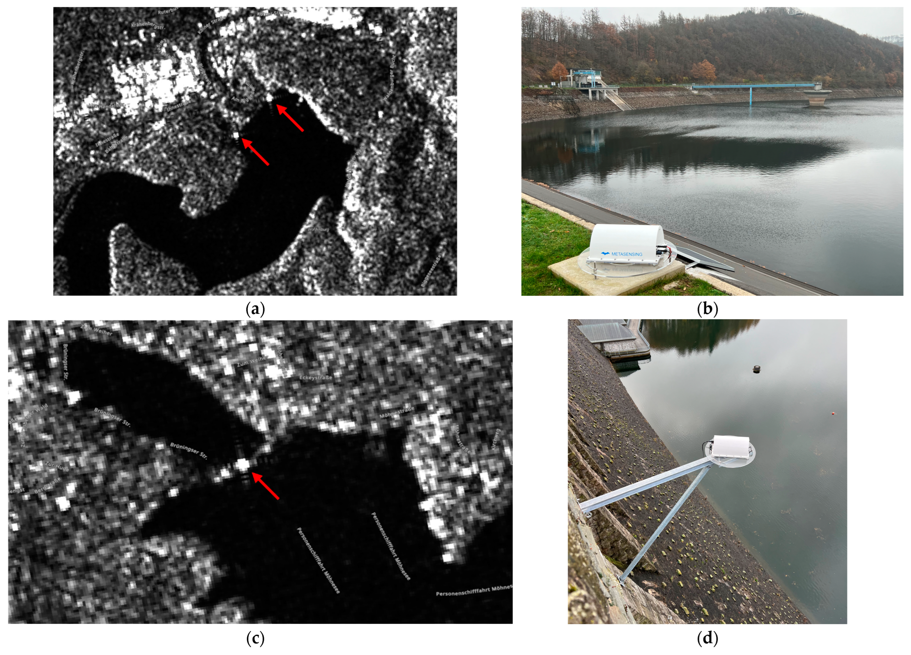

#### Using Electronic Corner Reflectors (ECR) for Dam Monitoring and Applying Sidelobe Minimization

The motivation for using Electronic Corner Reflectors (ECRs) arises from the fact that many dams exhibit insufficient natural Persistent Scatterer (PS) density due to unfavorable geometry, surface materials, land cover, or orientation relative to the satellite line of sight. In such cases, natural PS's alone cannot provide reliable or spatially complete deformation measurements. ECRs offer a targeted solution by artificially enhancing radar visibility at critical locations while remaining small, lightweight, and less intrusive than conventional passive corner reflectors, making them suitable even for architecturally challenging dam structures. Their ability to provide stable, high-quality radar returns in both ascending and descending viewing geometries enables consistent long-term monitoring. As part of this research project, six ECR devices were installed at five dams (embankment dams & gravity dams). 

The presented studies demonstrate that Electronic Corner Reflectors (ECRs) substantially improve the feasibility and reliability of MT-InSAR–based dam monitoring on structures with limited natural Persistent Scatterer (PS) coverage. The CR-Index was introduced as a key tool for ECR feasibility assessment, enabling the classification of dam visibility for PSI into three suitability classes using a traffic-light scheme. This supported the strategic placement of ECRs on gravity and embankment dams where geometric conditions, land cover, or structural characteristics restrict the detection of natural PS's. Signal stability analyses of ECRs revealed Amplitude Dispersion Index (ADI) values between **0.1 and 0.4**, comparable to conventional passive corner reflectors, confirming their suitability for long-term PSI monitoring. Comparisons with pendulum measurements showed fair agreement between ECR-based PS time series and in situ data (**R² up to 0.7, RMSE ~ 2 mm**), with errors remaining well below critical accuracy thresholds for concrete dams, although pendulum systems still provide approximately one order of magnitude higher accuracy.

However, the strong backscattering of ECRs can introduce strong sidelobe artifacts in SAR imagery, which may falsify nearby pixels and degrade PS detection and time-series quality. This motivates the need for sidelobe minimization. A novel amplitude-based Spatially Variant Apodization (SVA) approach [SVA-with-Snappy](https://github.com/natasnat/SVA-with-snappy) was developed at the University of Jena to mitigate sidelobe artifacts caused by strong ECR responses in Sentinel-1 data. Applied to the Sorpe Dam in Germany, the method reduced the number of sidelobe-affected PS by **39.26%**, while preserving the original interferometric phase and deformation estimates. The deformation time series remained highly consistent, with a Root Mean Square Error (RMSE) of approximately **0.38 mm**, demonstrating that sidelobe suppression can be achieved without compromising phase integrity. Together, these results confirm that ECR-supported PS time series, combined with dedicated sidelobe suppression strategies, significantly enhances MT-InSAR applicability for dam monitoring, provided that ECR deployment and data processing are carefully evaluated in advance.

     

© [Identifying Deformation Drivers in Dam Segments Using Combined X-and C-Band PS Time Series](https://www.mdpi.com/2072-4292/17/15/2629)
