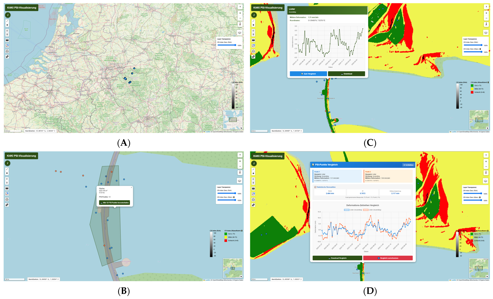

#### Application Programming Interface for Dam Monitoring

###### What are the main findings?

   - The long-term analysis of Sentinel-1 backscatter demonstrates stable signal behavior of all installed electronic corner reflectors (ECRs) **over more than 2.5 years (typical Amplitude Dispersion Index ≤ 0.4)**, confirming their suitability as highly coherent radar targets for Persistent Scatterer Interferometry (PSI).
   - PSI analyses based on the ECR installations yielded millimeter-level deformation estimates that agree with in situ plumb and trigonometric measurements, with typical Root Mean Square Error **(RMSE) values of 2 to 5 mm and correlations up to r = 0.7**, confirming the reliability of ECR-based PSI under real-world operational conditions.

###### What are the implications of the main findings?

   - ECRs enable PSI analyses at dams where conventional passive reflectors cannot be installed, providing **comparable signal stability but requiring higher operational maintenance**.
   - The developed operational PSI service integrates ECR-based PSI results and ground-motion products into **an accessible web platform**, supporting dam operators with interactive time-series visualization, standardized downloads, and practical decision-making tools for infrastructure surveillance.
    

     

© [An Integrated Monitoring Concept for Dam Infrastructure: Operational PSI Service and Application of Electronic Corner Reflectors (ECR)](https://www.mdpi.com/2072-4292/18/8/1214)

